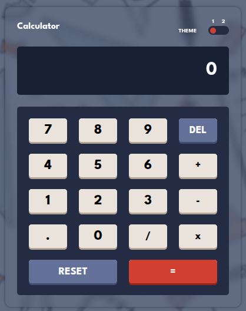

# Calculator Web App

A simple and interactive calculator built with HTML, CSS, and JavaScript.  
Switch between light and dark themes, perform basic arithmetic operations, and enjoy a modern responsive design.

## Table of Contents

- [Features](#features)
- [Demo](#demo)
- [Installation](#installation)
- [Usage](#usage)
- [Tech Stack](#tech-stack)

## Features

- Responsive calculator interface
- Light/Dark theme toggle
- Keyboard support for input
- Basic operations: addition, subtraction, multiplication, division
- Sound feedback on button press

## Demo

Try it live: [Demo Link](https://iahmed-fathy.github.io/Calculator/)

## Installation

1. Clone the repository:
git clone https://github.com/iahmed-fathy/calculator.git

2. Open `index.html` in your browser.

## Usage

- Click the buttons or use your keyboard to enter numbers and operations.
- Switch themes using the toggle at the top.
- Press `Enter` to calculate, `Backspace` to delete, and `C` to reset.

## Tech Stack

- HTML5
- CSS3 (Custom properties for theming)
- JavaScript (Vanilla)
